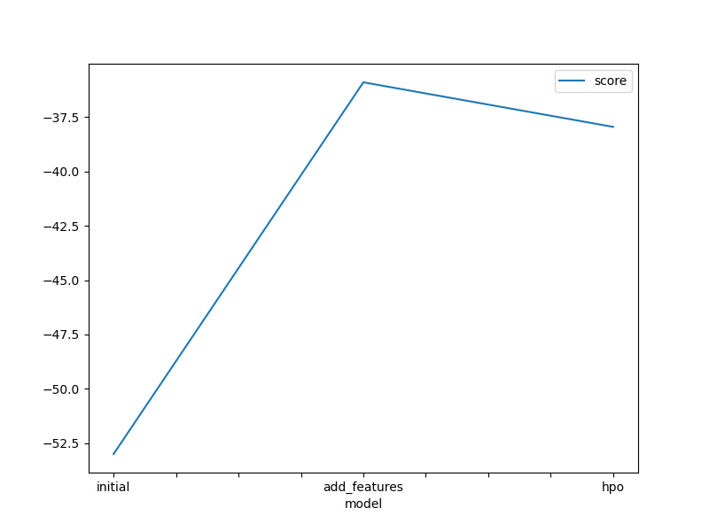
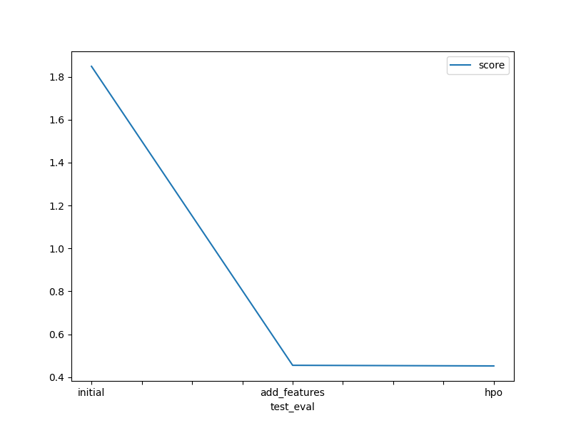

# Report: Predict Bike Sharing Demand with AutoGluon Solution
NAME: J. Mao

## Initial Training
### What did you realize when you tried to submit your predictions? What changes were needed to the output of the predictor to submit your results?
TODO: Add your explanation

When tried to submit my predictions, I realized that features: casual and registered are missing in test data, so I have to remove them from training data. 
The changes needed to the output of the predictor to submit my results is: set the negative values to zero so that Kaggle could accept the submission.

### What was the top ranked model that performed?
TODO: Add your explanation

The top 5 ranked model from my analysis were: WeightedEnsemble_L3, WeightedEnsemble_L2, ExtraTreesMSE_BAG_L2, CatBoost_BAG_L2, and XGBoost_BAG_L2.
The number 'x' following 'L' indicates stack level, L1 is a base model. From the ranking, base models are not as good as higher stack level models, which make sense since higher stack level models built based on those base models.

## Exploratory data analysis and feature creation
### What did the exploratory analysis find and how did you add additional features?
TODO: Add your explanation

It was found from EDA that categorical data were treated as numerical data in training, and numerical data were not standardized, meaning the means of data were not zero, which might introduce bias on features.
I created new features from feature 'datetime': 'year','month','day','hour' using dt function in pandas.

### How much better did your model preform after adding additional features and why do you think that is?
TODO: Add your explanation

The improvement was huge, Kaggle score went from 1.849 to 0.455, which was a significant improvement. 'hour' is more indicative of person's activity. During sleep time, bike share count could be extremely small compared to afternoon time.

## Hyper parameter tuning
### How much better did your model preform after trying different hyper parameters?
TODO: Add your explanation

Hyper parameter tuning was not a big success, it only achieved an improvement on Kaggle score from 0.455 to 0.453 after many trials. On the other side, it means AutoGluon analysis is pretty good out-of-the-box. 

### If you were given more time with this dataset, where do you think you would spend more time?
TODO: Add your explanation

I could spend more time on feature exploration, such as categorizes morning, lunch, and evening rush hour, 7-9am, 11am-1pm, and 5-6pm;  categorizes hot/cold/mild temps from 'temp' etc.

### Create a table with the models you ran, the hyperparameters modified, and the kaggle score.
|model|hpo1|hpo2|hpo3|score|
|--|--|--|--|--|
|initial|0.0003|'relu'|0.1|1.849|
|add_features|0.0003|'relu'|0.1|0.455|
|hpo|0.0005|'relu'|0.1|0.453|

### Create a line plot showing the top model score for the three (or more) training runs during the project.

TODO: Replace the image below with your own.

### Create a line plot showing the top kaggle score for the three (or more) prediction submissions during the project.

TODO: Replace the image below with your own.

## Summary
TODO: Add your explanation

Bike Sharing Demand prediction was performed using AutoGluon Solution. Additional features presented in training data but not in test data were removed from analysis, new feature 'hour' was extracted from feature 'dateime' and it turned out to be the number one important feature from the feature importance analysis.

Hyper parameters tuning was performed on 'nn_torch' model only. It was found that the result from optimization was close to the result using the default hyperparameters' setting.
Future works could be: 
1. More new features, such as categorizes morning, lunch, and evening rush hour, 7-9am, 11am-1pm, and 5-6pm; categorizes hot/cold/mild temps from 'temp' etc.
2. Perform hyperparameter tuning on other base models, such as 'GBM', 'CAT', 'XGB' etc.
 